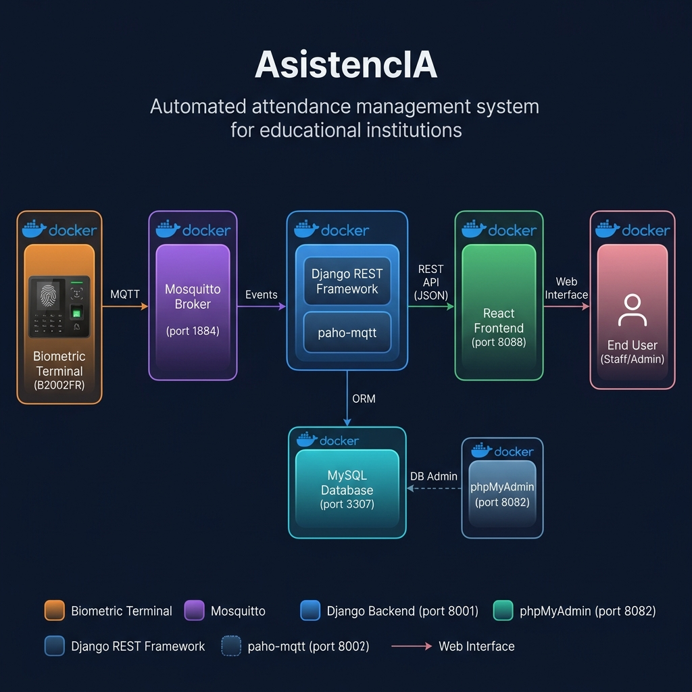

# AsistencIA

Automated attendance management system for educational institutions (ISAE). Uses facial recognition and temperature measurement via MQTT-enabled biometric terminals.

---

## 🏗️ Architecture

| Layer | Technology |
|---|---|
| Frontend | React 18 + TypeScript |
| Backend | Django 4.2 + Django REST Framework |
| Database | MySQL 8.0 |
| MQTT Broker | Mosquitto |
| Biometric Terminal | B2002FR-8I-CM-BTM-L06 |
| Containers | Docker + Docker Compose |

### Data Flow



The biometric terminal sends facial recognition + temperature data over **MQTT** → Mosquitto broker receives it → Django backend processes and stores it in **MySQL** → React frontend queries the **REST API** to display attendance records to staff.

---

## 🚀 Getting Started

### Prerequisites

- Docker
- Docker Compose

### 1. Clone the repository

```bash
git clone <repository-url>
cd asistencIA
```

### 2. Set up environment variables

```bash
cp backend/.env.example backend/.env
# Edit backend/.env with your configuration
```

### 3. Start the system

```bash
# Option 1: Automatic script (recommended)
./start.sh

# Option 2: Manual commands
docker compose build
docker compose up -d
```

### 4. First login

Create a Django superuser to access the system for the first time:

```bash
docker compose exec backend python manage.py createsuperuser
```

Then use those credentials to log in at `http://localhost:8088`.

---

## 🌐 Service URLs

| Service | URL |
|---|---|
| Frontend (React) | http://localhost:8088 |
| Backend API | http://localhost:8001/api |
| Django Admin | http://localhost:8001/admin |
| phpMyAdmin | http://localhost:8082 |

---

## 📂 Project Structure

```
asistencIA/
├── backend/                   # Django backend
│   ├── app/
│   │   ├── asistencias/       # Main app (models, views, serializers)
│   │   └── core/              # Core config (settings, urls)
│   ├── requirements.txt
│   └── Dockerfile
├── frontend/                  # React frontend
│   ├── src/
│   │   ├── pages/             # Dashboard, Personas, Asistencias, etc.
│   │   ├── components/        # Reusable UI components
│   │   ├── context/           # Auth context
│   │   └── hooks/             # Custom hooks
│   ├── package.json
│   └── Dockerfile
├── docs/                      # Documentation & protocol specs
├── mosquitto/                 # Mosquitto broker config
├── nginx/                     # Nginx reverse proxy config
├── docker-compose.yml
├── start.sh                   # Startup script
└── README.md
```

---

## 🔌 MQTT Integration

The system subscribes to attendance events published by the biometric terminal.

| Parameter | Value |
|---|---|
| Broker | Mosquitto |
| Host port | `1884` (TCP), `9002` (WebSockets) |
| Topic | `/asistencias/registro` |
| Payload | Person ID, temperature, timestamp |

---

## 🔐 Authentication & Permissions

- JWT-based authentication (SimpleJWT)
- Role-based access control
- Duplicate registration protection (25-minute window)
- Audit log for all critical actions

---

## 🛠️ Useful Commands

```bash
# View all logs
docker compose logs -f

# View logs for a specific service
docker compose logs -f backend
docker compose logs -f frontend

# Stop all services
docker compose down

# Rebuild after dependency changes
docker compose build --no-cache
docker compose up -d
```

---

## 📚 Documentation

Additional documentation is available in the [`docs/`](docs/) folder:

- `resumen_protocolo_mqtt.md` — Summary of the MQTT protocol used by the terminal
- `Terminal MQTT Protocol V1.24.pdf` — Full MQTT protocol specification
- `Terminals HTTP API File V1.33.pdf` — Full HTTP API specification
- `architecture_diagram.png` — System architecture diagram
