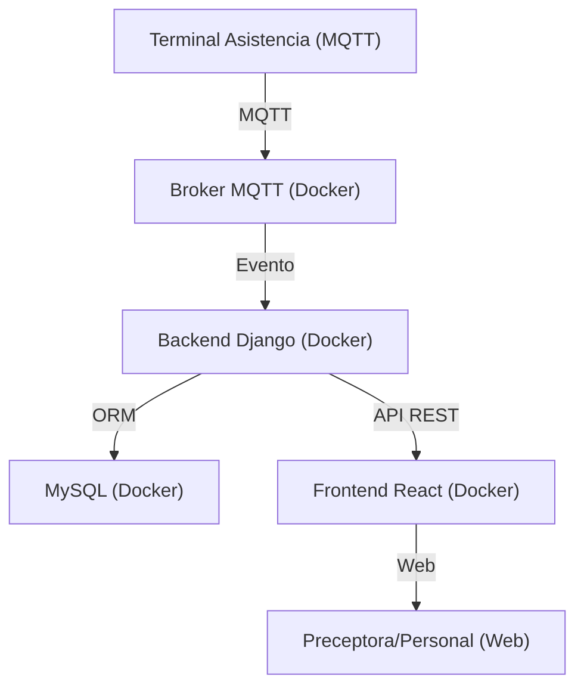

# Estructura del Proyecto

## Estructura de Carpetas

```
/asistencIA
  /backend      # Django
  /frontend     # React
  /docs         # Documentación y payloads
  /db_data      # Volumen para MySQL
  /backups      # Backups automáticos
  docker-compose.yml
  README.md
```

## Diagrama de Arquitectura



---

Iremos agregando aquí toda la información relevante sobre la estructura y arquitectura del proyecto.
